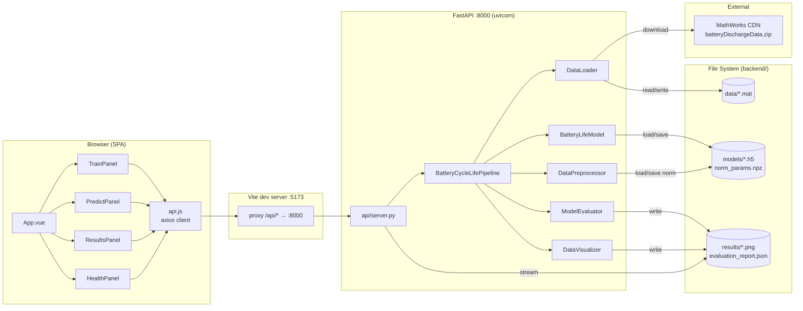
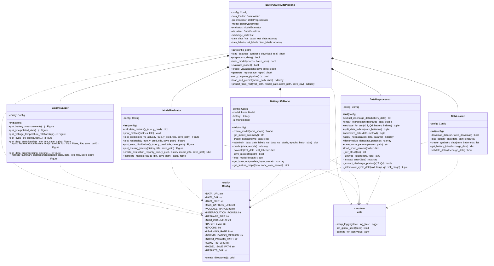
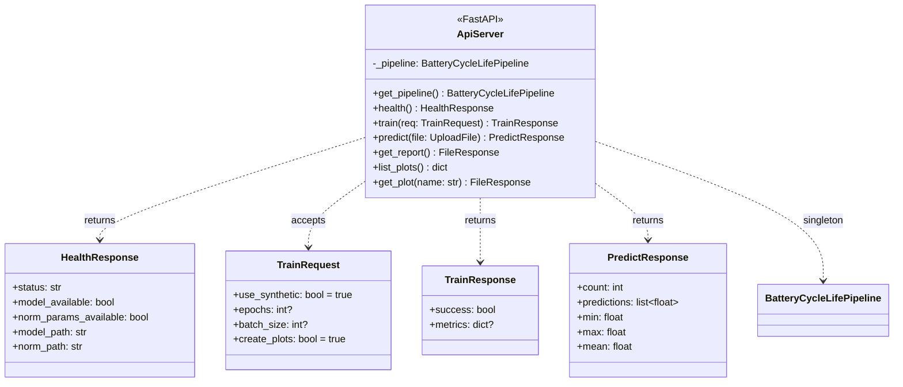
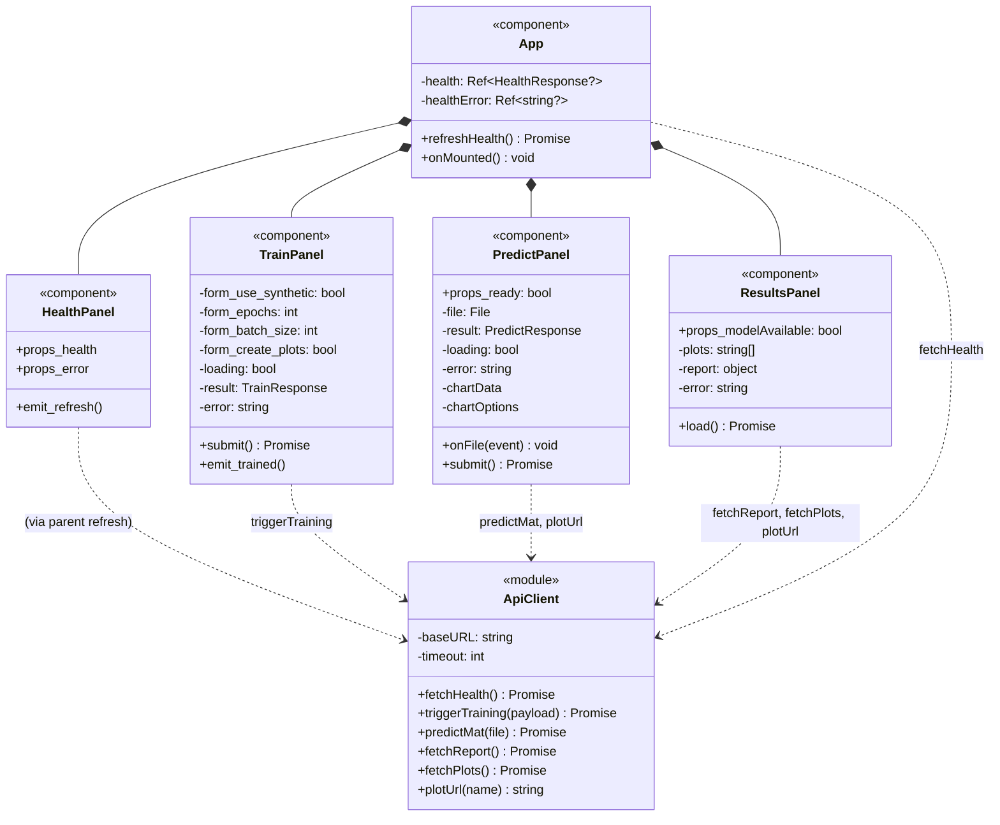
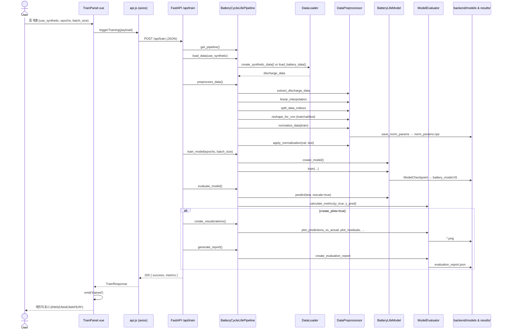
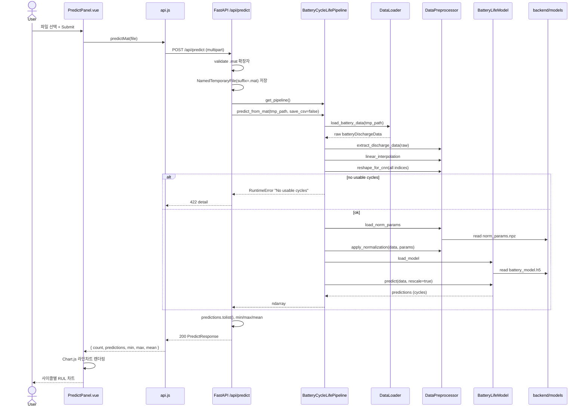
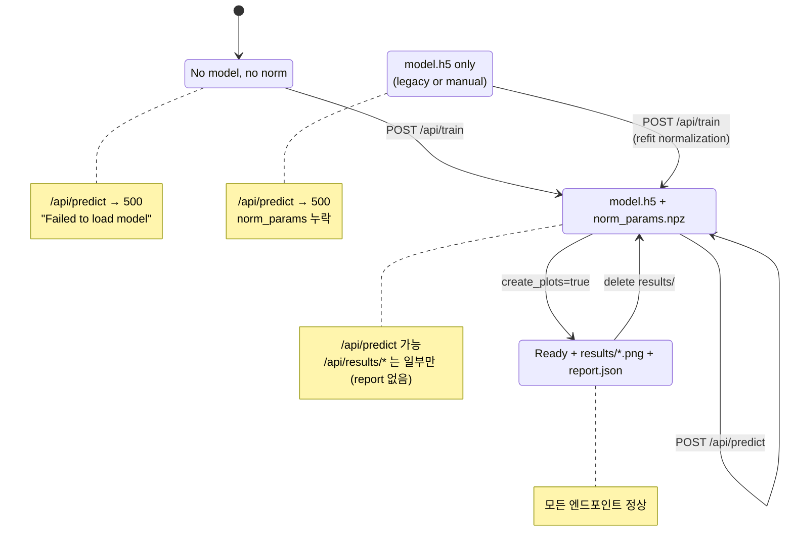
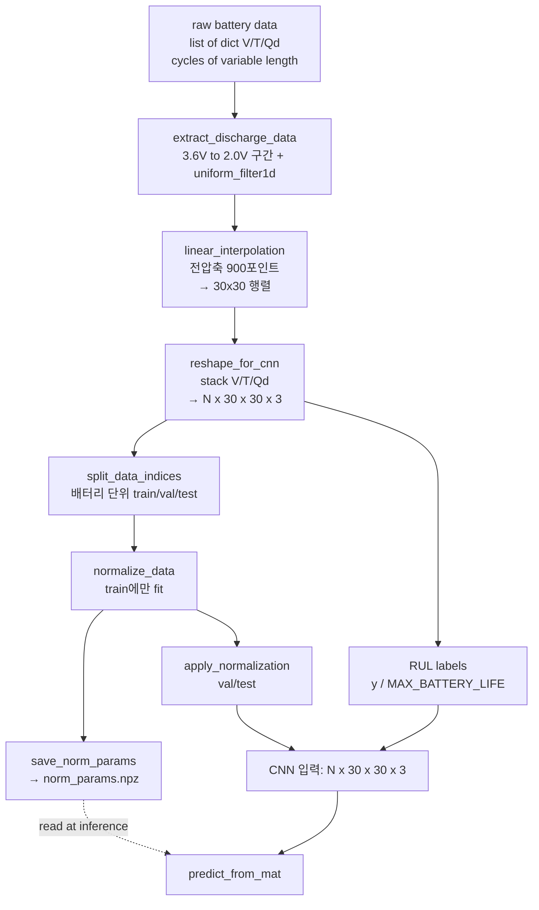

# UML Diagrams

현재 구현의 구조(class)와 행위(sequence, state, component)를 Mermaid로 정리한
다이어그램입니다. GitHub·VS Code·JetBrains IDE의 Markdown 프리뷰에서 바로
렌더링됩니다. 시스템 개요와 설계 근거는 [`ARCHITECTURE.md`](./ARCHITECTURE.md)를
참고하세요.

## 목차

- [1. Component Diagram](#1-component-diagram) — 배포 단위 수준 관계
- [2. Class Diagram (Backend)](#2-class-diagram-backend) — 파이썬 클래스·메서드
- [3. Class Diagram (API schemas)](#3-class-diagram-api-schemas) — Pydantic 모델
- [4. Class Diagram (Frontend components)](#4-class-diagram-frontend-components) — Vue 컴포넌트
- [5. Sequence: Training Flow](#5-sequence-training-flow)
- [6. Sequence: Prediction Flow](#6-sequence-prediction-flow)
- [7. State Diagram: Pipeline Artifacts](#7-state-diagram-pipeline-artifacts)
- [8. Data Flow (Preprocessing)](#8-data-flow-preprocessing)

---

## 1. Component Diagram

배포 단위(브라우저 SPA, FastAPI 프로세스, 파일 시스템)와 외부 의존성을
표시합니다.

---

## 2. Class Diagram (Backend)

주요 Python 클래스와 메서드, 집계 관계입니다. 화살표는 `has-a`(composition),
점선은 `uses`(의존) 관계입니다.

---

## 3. Class Diagram (API schemas)

FastAPI 레이어의 Pydantic 모델과 엔드포인트입니다.

---

## 4. Class Diagram (Frontend components)

Vue 컴포넌트 계층과 props·events·API 호출입니다.

---

## 5. Sequence: Training Flow

사용자가 TrainPanel에서 `Train` 버튼을 눌렀을 때의 전체 흐름.

---

## 6. Sequence: Prediction Flow

사용자가 PredictPanel에서 `.mat` 파일을 업로드했을 때.

---

## 7. State Diagram: Pipeline Artifacts

파일 시스템의 상태 변화에 따라 API가 허용하는 동작이 달라집니다. `/api/health`가
반환하는 `model_available` · `norm_params_available` 조합으로 현재 상태를
판단합니다.

---

## 8. Data Flow (Preprocessing)

원시 `.mat`/합성 데이터가 CNN 입력으로 변환되는 파이프라인입니다. Mermaid
flowchart로 shape 변화도 함께 표기합니다.

